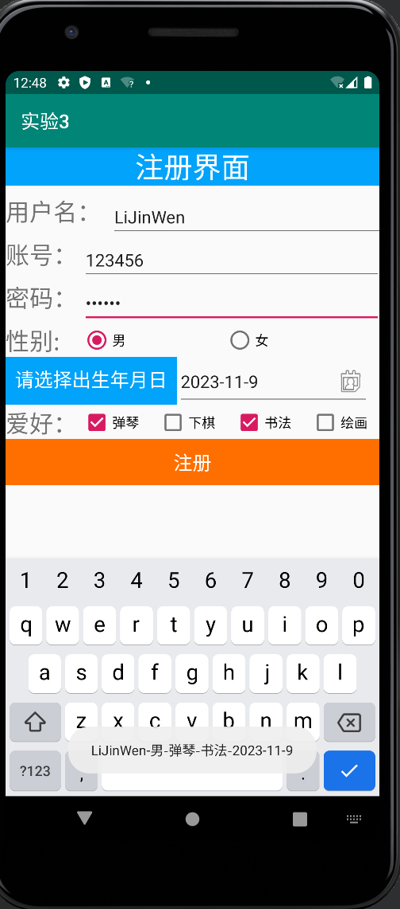
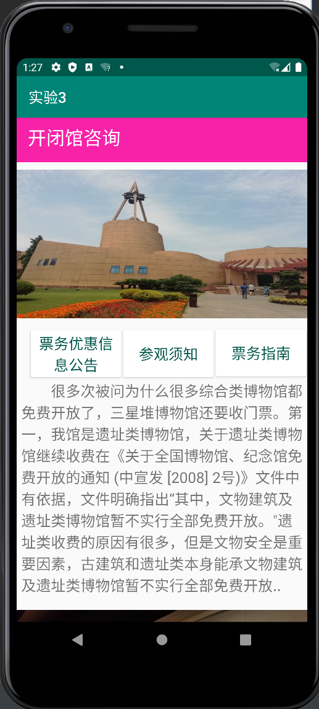

# 移动应用软件开发技术 实验3

## 一、 实验目的

1. 熟悉Android Studio开发工具使用

2. 理解事件监听方法

3. 能使用常用控件设计APP应用程序

## 二、 实验任务

1. 基本控件应用

2. 事件监听应用

3. 高级控件应用

## 三、 实验环境

PC机、Android Studio

## 四、 实验内容

### （一）、基本控件应用 

1. 编写程序，实现如下功能：

   设计一个用户登录的App，模拟用户通过账号或邮箱地址进行登录，并判断用户账号及密码是否正确，并给出相应的登录提示。登录界面提供账号，密码及登录类型的输入，单击登录按钮后，后台根据用户选择的类型，进行账号或邮件地址进行登录验证，并给出相关的登录提示。

假设后台的账号和密码是固定的，如：

内置账号：zhangsan 内置密码：123456

内置账号：zhangsan@163.com 内置密码：12345678

 ***要求***：（1）.使用hint属性；(2).使用Toast提示登录结果 

2. 运行结果


### （二） 基本控件应用 

1. 编写程序，实现如下功能：

   设计一个用于注册的APP。要求界面中的注册项包括：用户名、账号、密码、性别、出生年月日、爱好：

（1） 用户名框中只能输入大写字母；

（2） 账号框只能输入数字；

（3） 密码框不可显示明文；

（4） 性别用单选按钮，默认选中“男”；

（5） 出生年月日使用日期选择对话框输入，默认值为当前日期；

（6） 爱好用多选框实现，至少要有4个选项，默认选中第一个和第二个选项；

（7） 界面中有一个“注册”按钮，“注册”按钮要水平居中。

（8） 用户点击“注册”按钮后，Toast显示注册的用户名-性别-爱好-年/月/日

***要求：***（1）.使用hint属性；

2. 运行结果

### （三） TabLayout应用 

1. 编写程序，实现如下功能：

设计一个应用程序，显示咨询分类。类别和内容自拟，包括文字、图片等。

***要求：***（1）. 使用TabLayout+ScrollView； 

2. 运行结果

###（四） RecyclerView应用 

1. 编写程序，实现如下功能：

设计一个应用程序，显示新闻列表，每项内容为图片、标题、部分内容、日期。点击每个选项通过对话框方式显示详细内容。

***要求：***（1）. 使用RecyclerView；（2）点击对象可为图片、标题； 

2. 运行结果


### （五） 、高级控件应用 

1. 编写程序，实现如下功能：

继续为注册APP添加，当用户点击Back键时：

（1） 将所有文本输入框的文字清空，所有单选和复选按钮设为启动时的默认选项。

（2） 并弹出提示对话框，用户如果选择“确定”，则关闭APP。

（3） 提示：

```java

@Override
  public void onBackPressed() {

​    super.onBackPressed();

​    // 添加点击Back键后的逻辑代码

  }
```

2. 运行结果
